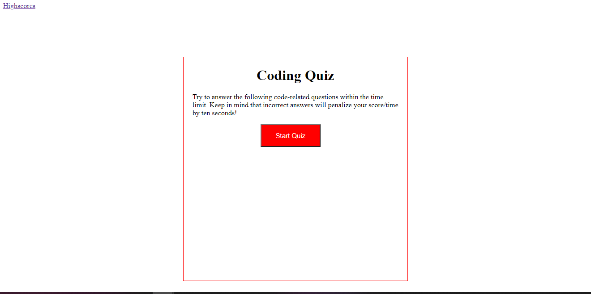
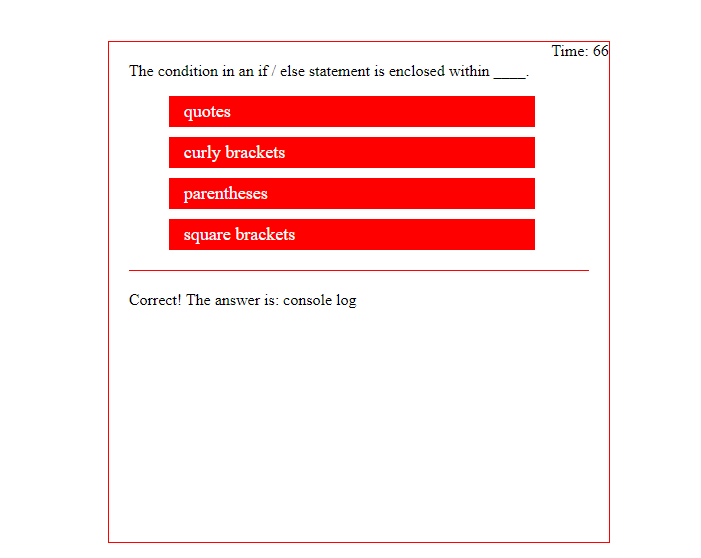
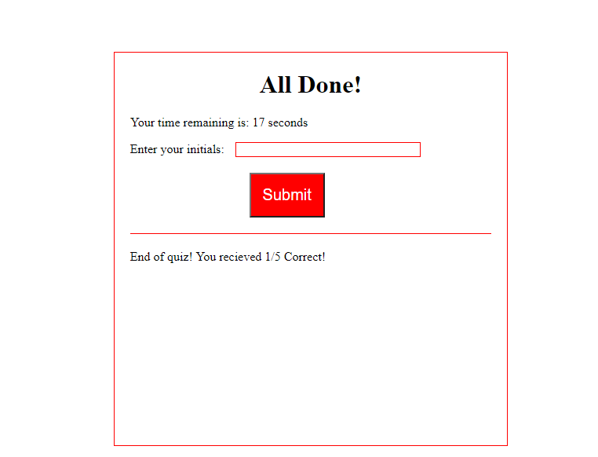
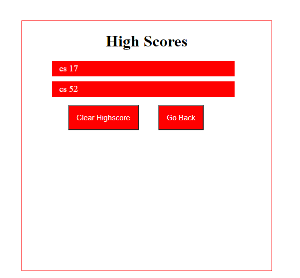

# Code-Quiz

## Project Description
This is a project that asks the user various multiple choice coding questions. There is a time limit of 75 seconds. With only 5 questions, the user will have 15 seconds per question. The users answeres are stored and compared to the correct answer. After the use answers each question they are notified whether their answer was correct or incorrect. At the end of the quiz, the user can submit their initials, and keep track of their scores. At the end of the quiez, the user hass the option to clear their previous scores and initials and to return to the beginning of the quiz. There is also a link to the High Scores page, which holds the users initials and their score. 

## Mock Up

## Initial Page

## Sample Question Page
Here is a sample question. The user chose the correct answer in this example, and is notified that they answered correctly underneat the questions. 

## Submit Initials and Score Page
Here the user can enter their initials and submit their score and initials to the Highschores page. 

### High Scores Page
Here is the High Scores page. The user can access this link by clicking on the "Highscores" link in the top left corner of the webpage. The user has the option to clear their high scores and to go back to the beginning of the quiz by clicking either the "Clear Highscore" button or the "Go Back" button.  

## Deployment

https://ccsxw6.github.io/Code-Quiz/